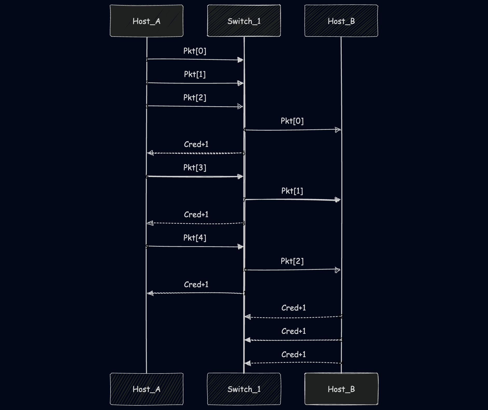

So I've been on job market recently and I often see Infiniband experience in "nice-to-have"s. I vaguely know that it is fast interconnect in datacenters and for sure dont know all quirks of it. So lets make our own version to learn. But first of all, what even is Infiniband?

## What and why?

In the late 90s, CPUs were getting faster, but getting data into them was the bottleneck. Traditional networking (TCP/IP over Ethernet) had two major issues:
- High Latency: Switches used "Store-and-Forward" (wait for the whole packet to arrive before sending).
- CPU Overhead: The OS kernel had to process every packet (interrupts, copying memory).
- Packet Loss: If a switch buffer got full, Ethernet would simply drop the packet, forcing a slow TCP retransmission.

InfiniBand was designed to solve this:
- Kernel Bypass (RDMA): The hardware (HCA) writes data directly to application memory.
- Credit-Based Flow Control: A "lossless" network that never drops packets due to congestion.
- Cut-Through Switching: Forwarding the packet header before the tail has even arrived.

Let's simulate these components one by one.  
*I will be skipping some non-essential components like Packet/Link, check [github](https://gist.github.com/wtfnukee/3bf9ee736001fe85e6bd4578602f0612) for full code*

## The Simulation Kernel
Since network events happen in nanoseconds and asynchronously, a simple while loop won't work. We need a priority queue to manage time. This allows us to simulate the physical delay of a cable (0.1ns) vs. the processing delay of a switch (0.05ns).
```python
class Simulator:
    def __init__(self):
        self.events = []  # Priority Queue
        self.current_time = 0.0
        self.event_id_gen = itertools.count()  # <--- Unique ID Generator

    def schedule(self, delay, callback, *args):
        execution_time = self.current_time + delay
        # We add next(self.event_id_gen) as a tie-breaker.
        # Structure: (Time, UniqueID, Callback, Args)
        # Python compares tuples element-by-element. If Time matches, it compares UniqueID.
        # Since UniqueID is always different, it never reaches Callback or Args.
        heapq.heappush(
            self.events, (execution_time, next(self.event_id_gen), callback, args)
        )

    def run(self, max_time=1000):
        while self.events and self.current_time < max_time:
            # Unpack the 4-element tuple (ignoring the ID)
            time, _, callback, args = heapq.heappop(self.events)
            self.current_time = time
            callback(*args)
```

## Credit-Based Flow Control
In Ethernet, if a buffer is full, the packet is dropped. In InfiniBand, the sender is not allowed to send unless it knows the receiver has space. This is managed via Credits.  
Every port tracks tx_credits (how much space the neighbor has).
- Sending a packet decrements a credit.
- If credits hit 0, the hardware stalls.
- When the neighbor frees buffer space, it returns a credit.
Here is our implementation of the physical port:
```python
class Port:
    def __init__(self, parent_node, port_num, buffer_size=3):
        self.parent = parent_node
        self.num = port_num
        self.connected_link = None
        self.remote_port = None

        # --- Flow Control ---
        self.max_credits = buffer_size
        self.tx_credits = 0  # Credits we have to send to remote
        self.rx_buffer = collections.deque()  # Actual packet storage

        # Stats
        self.packets_sent = 0
        self.packets_received = 0

    def connect(self, link):
        self.connected_link = link
        # Identify the other side
        if link.port_a == self:
            self.remote_port = link.port_b
        else:
            self.remote_port = link.port_a

        # Initial Credit exchange (simulate link training)
        self.tx_credits = self.remote_port.max_credits

    def can_send(self):
        return self.tx_credits > 0

    def send_packet(self, packet):
        if can_send():
            self.tx_credits -= 1
            self.packets_sent += 1
            # Schedule arrival at other side (Propagation Delay)
            # Serialization delay = size / bandwidth (ignored for simplicity now)
            arrival_time = self.connected_link.latency
            sim.schedule(arrival_time, self.remote_port.receive_packet, packet)
            return True
        # STALL! We cannot send. The link is paused.
        return False

    def receive_packet(self, packet):
        self.rx_buffer.append(packet)
        self.packets_received += 1

        # Trigger processing in the parent Node (HCA or Switch)
        self.parent.process_buffer(self)

    def return_credit(self):
        """Called when parent frees buffer space. Sends credit update back."""
        # In real IB, this is piggybacked or a Flow Control Packet.
        # Here we simulate the delay of a credit update.
        sim.schedule(0.05, self._update_remote_credit)

    def _update_remote_credit(self):
        # Directly update remote counter for simulation simplicity
        if self.remote_port:
            self.remote_port.tx_credits += 1
            # If the sender was stalled, they might want to wake up
            self.remote_port.parent.check_send_queue(self.remote_port)
```

## Cut-Through Switching
Standard switching is slow because it buffers the whole packet. InfiniBand uses Cut-Through switching. As soon as the header arrives and we know the Destination LID (Local ID), we look up the Forwarding Table (LFT) and send it out the egress port, even if the tail hasn't arrived yet.
```python
class IBSwitch(IBNode):
    def __init__(self, name, num_ports=4):
        super().__init__(name)
        self.lft = {}  # Linear Forwarding Table: LID -> PortNum
        for i in range(1, num_ports + 1):
            self.add_port(i)

    def set_lft(self, lid, port_num):
        self.lft[lid] = port_num

    def process_buffer(self, ingress_port):
        if not ingress_port.rx_buffer:
            return

        packet = ingress_port.rx_buffer[0]  # Peek
        out_port_num = self.lft.get(packet.dst_lid)

        if out_port_num is None:
            ingress_port.rx_buffer.popleft()
            ingress_port.return_credit()
            return

        egress_port = self.ports[out_port_num]

        # Try to forward (Cut-Through)
        if egress_port.can_send():
            # Move packet from Ingress to Egress
            pkt = ingress_port.rx_buffer.popleft()

            # Processing Delay (Switch Logic latency)
            sim.schedule(0.05, egress_port.send_packet, pkt)

            # Free up ingress buffer (Credit Return)
            ingress_port.return_credit()
        else:
            # Head-of-Line Blocking simulated here
            pass

    def check_send_queue(self, port):
        # Triggered when credits return.
        # A real switch would check internal crossbar queues.
        # Simplification: We rely on the receive event loop for retry logic in this basic sim
        pass
```

## Subnet Manager
Unlike Ethernet which "learns" mac addresses via flooding (ARP/Broadcasting), InfiniBand is centrally managed. The Subnet Manager (SM) is a piece of software that discovers the topology, assigns addresses (LIDs), and programs the forwarding tables (LFTs) on all switches.
```python
class SubnetManager:
    def discover_and_configure(self, nodes):
        print("--- SM: Starting Discovery ---")
        
        # 1. Assign LIDs to Hosts
        for i, node in enumerate(nodes):
            node.lid = i + 1
            print(f"SM: Assigned LID {node.lid} to {node.name}")

        # 2. Program Switch Routes (BFS Algorithm)
        # (Simplified routing logic omitted for brevity - full code on github)
```

## Experiment: Forcing a Traffic Jam
To prove the simulation works, we set up a scenario designed to fail on standard Ethernet but just "pause" on InfiniBand.  
>Topology: Host A -> Switch -> Host B.  
>Constraint: We set the Buffer Size to 3.  
>Traffic: We send a burst of 5 packets.  
Since 5 > 3, Host A should run out of credits after the 3rd packet and stall until the Switch moves packets forward.



**Results**  
Here is the actual output from our Python simulator:
```
--- SM: Starting Discovery ---
SM: Assigned LID 1 to Host_A
SM: Assigned LID 2 to Host_B
SM: Configured Switch_1 LFT: LID 1 -> Port 1
SM: Configured Switch_1 LFT: LID 2 -> Port 2

--- Starting Traffic ---
[send_packet] 0.00ns: Host_A-P1 SENT <Pkt SRC:1 DST:2 #:0> (Credits left: 2)
[send_packet] 0.00ns: Host_A-P1 SENT <Pkt SRC:1 DST:2 #:1> (Credits left: 1)
[send_packet] 0.00ns: Host_A-P1 SENT <Pkt SRC:1 DST:2 #:2> (Credits left: 0)
```

**Stall**  
Look at that last line. Credits left: 0. Host A still has packets #3 and #4 in its queue, but it stops transmitting. In a standard network, this might have caused a buffer overflow drop. Here, the link just goes silent.

**Resume**
Processing takes time. At 0.15ns, the Switch finishes processing packet #0 and forwards it to Host B. This frees up a slot in the Switch's input buffer, causing a credit to fly back to Host A.
```
[send_packet] 0.15ns: Switch_1-P2 SENT <Pkt SRC:1 DST:2 #:0> (Credits left: 2)
[send_packet] 0.15ns: Host_A-P1 SENT <Pkt SRC:1 DST:2 #:3> (Credits left: 0)
```
As soon as that credit arrives, Host A wakes up and sends packet #3. The cycle repeats for packet #4.
```
[send_packet] 0.15ns: Switch_1-P2 SENT <Pkt SRC:1 DST:2 #:1> (Credits left: 1)
[send_packet] 0.15ns: Host_A-P1 SENT <Pkt SRC:1 DST:2 #:4> (Credits left: 0)
[send_packet] 0.15ns: Switch_1-P2 SENT <Pkt SRC:1 DST:2 #:2> (Credits left: 0)
```

**Arrival**
```
[process_buffer] Host_B RECEIVED <Pkt SRC:1 DST:2 #:0> | Latency: 0.25ns
[process_buffer] Host_B RECEIVED <Pkt SRC:1 DST:2 #:1> | Latency: 0.25ns
[process_buffer] Host_B RECEIVED <Pkt SRC:1 DST:2 #:2> | Latency: 0.25ns

--- Stats ---
Host A Sent: 5
Host B Recv: 3
Switch Forwarded: 3
```
*(Note: Packets 3 and 4 were still in flight when the simulation snapshot ended).*
