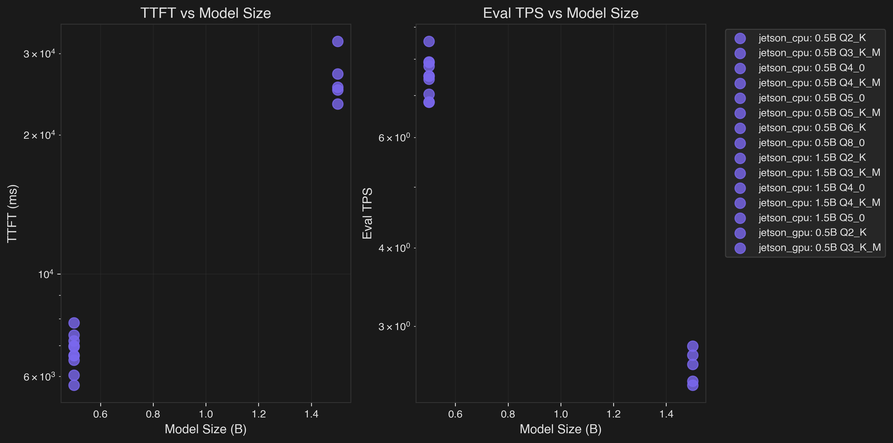
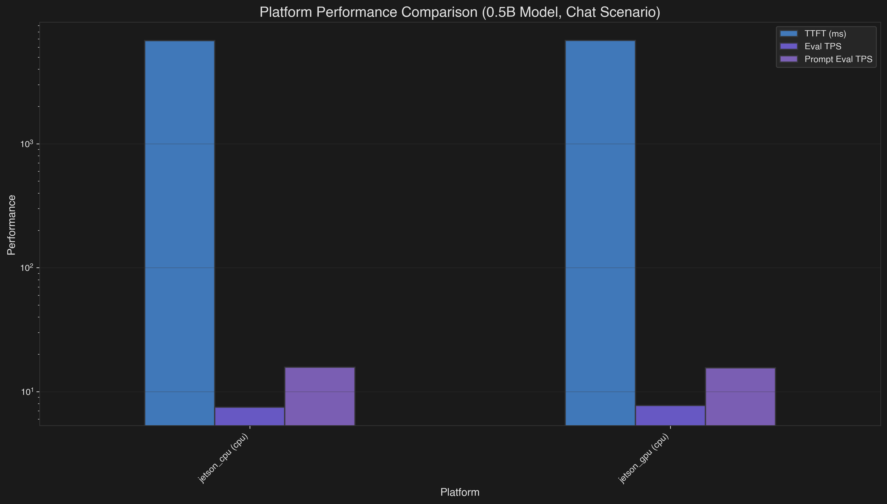
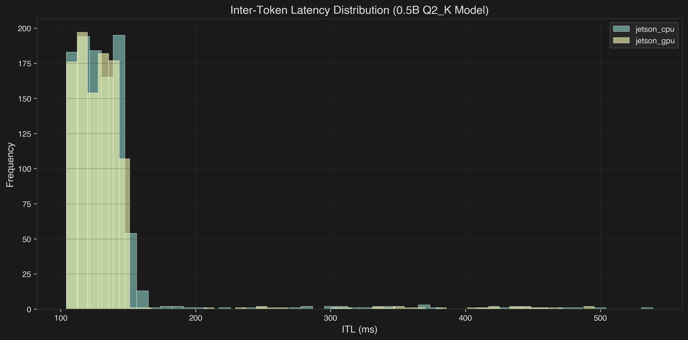
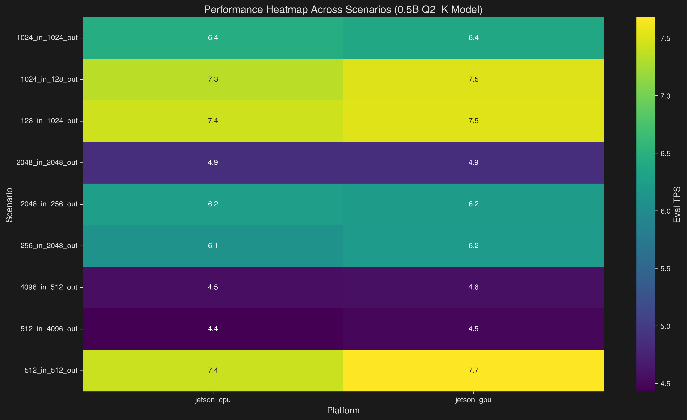
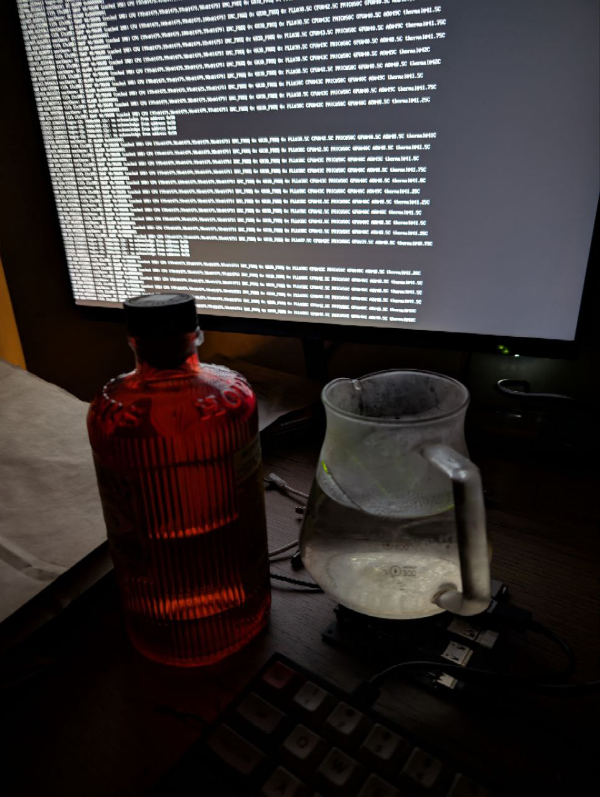

Seven years ago I bought a Jetson Nano 2GB for $70. I ran some graphics and computer vision examples, but I mostly used it as a multimedia server (I used to watch YouTube and films on an Xbox 360, so it was a less weird alternative).  
Today is some day in December 2025, and I want to bring this beast, with a whopping 128 CUDA cores, back to life and see whether it can survive "The Trial of the LLMs".

## Setup

First of all, we need to get Linux running on the machine. The microSD card I bought with the Jetson was used for my DSLR, so let's build an image from scratch.  
I still remember that the official NVIDIA images are a pain; fortunately, we are blessed with a better (and lighter!) alternative: [pythops/jetson-image](https://github.com/pythops/jetson-image).



- For some reason I couldn't run it as-is and had to use Multipass to create an Ubuntu VM
```
brew install --cask multipass
multipass launch --name builder --cpus 4 --mem 8G --disk 50G jammy
multipass shell builder
```

- Get Prebuilt MPR
```
wget -qO - 'https://proget.makedeb.org/debian-feeds/prebuilt-mpr.pub' | gpg --dearmor | sudo tee /usr/share/keyrings/prebuilt-mpr-archive-keyring.gpg 1> /dev/null
echo "deb [arch=all,$(dpkg --print-architecture) signed-by=/usr/share/keyrings/prebuilt-mpr-archive-keyring.gpg] https://proget.makedeb.org prebuilt-mpr $(lsb_release -cs)" | sudo tee /etc/apt/sources.list.d/prebuilt-mpr.list
sudo apt update
```

- Install some tools
```
sudo apt install -y git just jq podman qemu-user-static
```


After setup, we can 
```
git clone https://github.com/pythops/jetson-image
cd jetson-image
```
and make a rootfs with a five-major-versions-old Ubuntu
```
just build-jetson-rootfs 20.04
```
Build the image for our board
```
just build-jetson-image -b jetson-nano-2gb -l 32
```
Copy the image back to the host
```
multipass transfer builder:/home/ubuntu/jetson-image/jetson.img .
```
and finally flash the image onto the board
```
sudo dd if=jetson.img of=/dev/diskN bs=1m
```


I thought that this would be as easy as
```
sudo nmcli device wifi list
sudo nmcli device wifi connect "YourSSID" password "YourPassword"
```
But `pythops/jetson-image` is too lightweight — even `iwconfig` or any networking doesn't work.  
I forked the repo and added some files to support networking out of the box — [wtfnukee/jetson-image](https://github.com/wtfnukee/jetson-image.git). It installs the missing packages so the commands above work.



## Logging in
After typing the login `jetson` and password `jetson`, we're in!  
Running `free -m` shows a total of `~1700 MB` of 64-bit LPDDR4 to spare. That's CPU RAM and GPU VRAM **combined**, so we'll try to use as much of it as possible.

Obviously, beefy engines like `vLLM` or `sglang` are out of the question, so we have to resort to [llama.cpp](https://github.com/ggml-org/llama.cpp). We could write something from scratch using minimal overhead like [llama.c](https://github.com/karpathy/llama2.c), but I want to run modern LLMs and not debug C/C++/Rust code. Oh no, that's exactly what I ended up doing.

Here is the first pitfall: `llama.cpp` doesn't provide a `linux-cuda-arm64-smth` binary, so building it from source is the only option.  
Some [madlad](https://www.caplaz.com/jetson-nano-running-llama-cpp/) already did this, but they had the 4GB version, it will be interesting to see speed difference.

## Benchmarking
I thought that just running couple of prompts is too simple, so inspired by [LLM's Engineer Almanac by Modal](https://modal.com/llm-almanac/how-to-benchmark) I've decided to write my own benchmarking tool.

Original code [modal-labs/stopwatch](https://github.com/modal-labs/stopwatch) runs on Modal and tested vLLM, SGLang, and TensorRT-LLM.  
My version [wtfnukee/hourglass](https://github.com/wtfnukee/hourglass) is smaller (and focused on edge devices), hence the name.

### Hourglass
Hourglass is a Rust-based CLI tool specifically designed for benchmarking LLMs on edge devices. Unlike cloud-focused benchmarks, it's optimized for resource-constrained devices with thermal throttling, limited memory, and shared CPU/GPU memory architectures.

Key Features:
- Multi-Backend Support: CPU, CUDA (Jetson/x86), Metal (Apple Silicon), and Vulkan
- Comprehensive Metrics: TTFT, ITL, TTLT, throughput, system resource usage
- Edge Device Focus: Optimized for devices like Jetson Nano, Raspberry Pi
- System Monitoring: Tracks CPU/GPU usage, memory, temperature, and power consumption
- Structured Output: JSON output for easy analysis and visualization

Our test subject is [Qwen/Qwen2.5-{size}-Instruct](https://huggingface.co/Qwen/Qwen2.5-0.5B-Instruct-GGUF), 3 model sizes (only 0.5B, 1.5B, 3B dense models) in 8 quantizations (q2_k, q3_k_m, q4_0, q4_k_m, q5_0, q5_k_m, q6_k and q8_0). Following Almanac we'll measure TTFT, ITL, TTLT and throughput on sequences below:

| in tokens | out tokens | scenario |
|-----------|------------|----------|
| 128 | 1024 | chat |
| 256 | 2048 | long response |
| 512 | 512 | balanced |
| 512 | 4096 | generation heavy |
| 1024 | 128 | completion |
| 1024 | 1024 | standard chat |
| 2048 | 256 | RAG style |
| 2048 | 2048 | long context |
| 4096 | 512 | context heavy |

Instruct version was chosen because it handles instructions better and talks more like a human -- which helps when you're benchmarking alone at 2 a.m. and need emotional support from an AI girlfriend running at 0.3 tokens/s.

### Understanding Bottleneck

Before diving into results, let's understand what limits the Jetson Nano. Here are the key specs:

**Hardware:**
- CPU: 4$\times$ ARM Cortex-A57 @ 1.43 GHz
- GPU: 128 CUDA cores (Maxwell) @ 921 MHz max
- Memory: 2GB LPDDR4 @ 1600 MHz
- **Memory bandwidth: 25.6 GB/s** (shared between CPU and GPU)
- Storage: Samsung EVO Plus 64GB microSD (~130 MB/s read, ~10 MB/s write)

People are mocking $4000 DGX Spark for 273GB/s of memory bandwidth, but how do you like tenth of that?

LLM inference has two phases:

1. **Prefill (prompt processing):** Memory-bound. Loading model weights dominates.
2. **Decode (token generation):** Compute-bound. Matrix multiplications on small batches. (Assuming KV cache. Please do.)

For a model like Qwen2.5-0.5B in Q4 quantization (~408 MB), let's calculate the [rooflines](https://jax-ml.github.io/scaling-book/inference/):

**Prefill arithmetic intensity:**
- Must load entire weight matrix: ~408 MB (Q4_0)
- For 512 tokens: 411 $\times$ 2 $\times$ 0.5B params ≈ 411 GFLOP
- Processing in 1 batch (512 batch size): load model once
- Arithmetic intensity: 411 GFLOP / 408 MB ≈ **1,007 FLOP/byte**

**Theoretical peak (memory-bound):**
- Memory bandwidth: 25.6 GB/s
- Peak prefill: 25.6 GB/s $\times$ 1,007 FLOP/byte ≈ **25.8 TFLOPS**

But the GPU's actual compute: 128 cores $\times$ 921 MHz $\times$ 2 (FMA) ≈ **0.236 TFLOPS**

**Prefill is memory-bound** (25.8 TFLOPS $\gg$ 0.236 TFLOPS). We're bandwidth-starved. Bandwidth-fucked, dare I say.

**Observed: 115.89 tokens/s**
```
Prefill: 411 tokens in 3.55s = 115.89 t/s
Throughput: 115.89 t/s $\times$ 1 GFLOP/token $\approx$ 115.89 GFLOPS
Bandwidth used: 408 MB / 3.55s = 115 MB/s
Efficiency: 115.89 / 25,800 = 0.45% of theoretical peak
```

Still only 0.45% efficiency, but **4× faster than CPU** (115.89 vs 28.87 t/s).

---

**Also:** The model lives on a microSD card. If we exceed 2GB memory and start swapping, we're reading weights at **10-130 MB/s** instead of 25.6 GB/s. That's a **200-2500× slowdown**. Jetson used swap extensively for big models and it was miserable.

---

**Decode arithmetic intensity:**
- Generate 1 token: $\sim$193M FLOPs (24 layers $\times$ 8M FLOPs/layer)
- Must load weights: $\sim$408 MB (assuming no caching)
- With 50% cache hit: $\sim$204 MB per token
- Arithmetic intensity: 193M FLOPs / 204 MB $\approx$ **0.95 FLOP/byte**

**Theoretical peak (memory-bound):**
- Memory bandwidth: 25.6 GB/s
- Peak decode: 25.6 GB/s $\times$ 0.95 FLOP/byte $\approx$ **24.3 GFLOPS**
- GPU compute limit: **236 GFLOPS**

**Decode is memory-bound** (24.3 GFLOPS $\ll$ 236 GFLOPS).

**Observed: 8.0 tokens/s**
```
Decode: 511 tokens in 63.8s = 8.0 t/s
Throughput: 8.0 t/s $\times$ 193M FLOP/token = 1.54 GFLOPS
Efficiency: 1.54 / 24.3 = 6.3% of bandwidth
```

Only 6.3% efficiency, but typical for single-batch inference on edge devices. GPU is slightly faster than CPU (8.0 vs 7.43 t/s) but not dramatically - both are memory-bound.


### CPU
Well, the Nano says hello... eventually.  
Loading times are rough: the lightest model (0.5B q2) needs almost 7 seconds, while the heaviest (1.5B q5) takes around 32 seconds.
Token generation speed is actually fine, ranging from 8 -> 2.5 tok/s for same models. However, the TTFT is so high that using the CPU backend for any latency-sensitive scenario (like interactive chat) becomes impractical. If all you need is simple batch inference or occasional scripted calls, it works - but anything resembling real-time responsiveness is out of reach.


### GPU

Although I was using `gcc-8`, compilation failed with "unsupported GNU version" error. So I just commented check `/usr/local/cuda/include/crt/host_config.h` (lines 137-141). It compiles and runs smoothly without downgrading `gcc`.  
And use `ccache` to speed up compilation.


Even the smallest model in q8_0 cannot fully fit on the GPU — the best configuration I managed was 24/25 layers on GPU and 1 on CPU, which introduces a small but noticeable cross-device penalty.
However, once loaded, things look much better.
TTFT drops massively, down to 1.2-3 seconds, making the GPU path dramatically more usable for interactive workloads. While the sustained generation speed is roughly similar to the CPU (still around 8 -> ~2.5 tok/s depending on the model), prefill performance sees ~7× improvement, which is exactly where GPU acceleration matters most for LLMs.


### Bonus: Macbook Air M3
Just for fun, I also ran the same tiny models on a MacBook Air M3. Apple’s inference efficiency continues to be ridiculous:
```
0.5B q2_k — results/m3/0.5b-q2_k.json
prompt_eval_tps: 158,633.26
eval_tps:        1,186.81
```
```
3B q8_0 — results/m3/3b-q8_0.json
prompt_eval_tps: 162,720.99
eval_tps:          524.94
```

The M3 absolutely obliterates both CPU and GPU results on the Nano, especially in the prompt_eval phase. Even the 3B model runs with surprisingly high throughput for a fanless ultraportable. Apple’s unified memory + optimized Metal kernels continue to make small and mid-sized models feel effortless.

### Performance Visualizations


*Left: TTFT vs Model Size | Right: Eval TPS vs Model Size*

This chart shows how performance degrades as model size increases across Jetson CPU (purple) and GPU (blue) backends. The GPU shows significant advantages for larger quantizations (Q4_0+), while smaller quantizations (Q2_K) show minimal GPU benefit.

#### Platform Comparison


This bar chart compares Jetson CPU vs GPU performance across key metrics:
- **TTFT (Time to First Token)**: GPU is ~5-6× faster than CPU for optimal quantizations (Q4_0/Q5_0)
- **Eval TPS (Sustained Generation)**: GPU shows modest improvements in sustained token generation
- **Prompt Eval TPS**: GPU demonstrates ~80× improvement over CPU in prompt processing due to memory bandwidth advantages

#### Quantization Efficiency


This scatter plot reveals the efficiency of different quantization levels on Jetson:
- Q2_K provides the best performance per GB for CPU
- Q4_0/Q5_0 show better GPU utilization despite larger size
- Color intensity represents absolute Eval TPS performance

#### Inter-Token Latency Distribution


The ITL distribution shows:
- Jetson CPU and GPU have similar latency profiles for token generation
- Most tokens are generated in 100-150ms range
- Some outliers show occasional performance hiccups

#### Performance Heatmap


This heatmap shows Eval TPS across different scenarios for Jetson CPU vs GPU:
- GPU shows consistent advantages across most scenarios
- Performance varies based on input/output token ratios
- Chat scenarios (128_in_1024_out) show best relative GPU improvements


### Thermal Management

Heatsink stabilizes at 60C under sustained load, so to avoid thermal throttling I needed to swap gin bottle and coffee server full of ice between freezer and heatsink.  
I also got Overcurrent Alarm, maybe because I fed my 10W Jetson with 120W Macbook Pro charger, but I'm not sure, I couldn't google problem cause.

## Conclusion
Not bad for a $70 board from 2018. Sure, it's 100x slower than an M3, but it's running actual LLM inference on a device that's mostly heatsink and hopes.

Still, it's only thing with CUDA cores (alas outdated but 5 generations. I mean, Ada Lovelace has [128 CUDA cores are included in **each** SM](https://en.wikipedia.org/wiki/Ada_Lovelace_(microarchitecture)#:~:text=128%20CUDA%20cores%20are%20included%20in%20each%20SM.)) I own and have direct access.

I've just started digging deeper into CUDA, so expect more posts soon.

---
I spent four days juggling bottles to get these numbers.  
Literally.  
Because of that, producing good plots was harder than producing the data itself. I wasn’t entirely sure what to visualize, what comparisons would be meaningful, or which metrics deserved the spotlight. So for now, please rely on the textual results and analysis above. Proper graphs will come later, once I stop using my kitchenware as a thermal management system.

## Acknowledgments
- steelph0enix for [llama.cpp guide](https://blog.steelph0enix.dev/posts/llama-cpp-guide/#llama-bench)
- Modal (pls hire me) for [LLM's Engineer Almanac](https://modal.com/llm-almanac/how-to-benchmark)
- pythops for [jetson-image](https://github.com/pythops/jetson-image) and [tegratop](https://github.com/pythops/tegratop)
