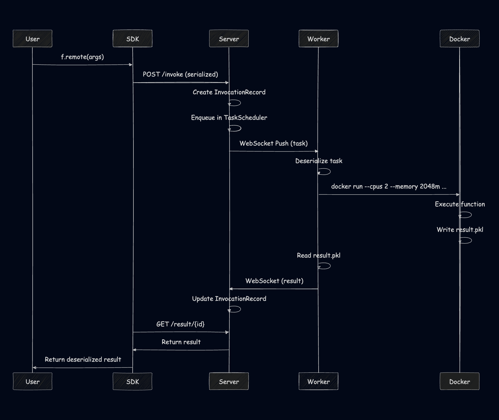

---

**Disclaimers!**
1. This is still work in progress. Although common API is established, underlying algorithms are subject to change.
2. It is toy project, but I really wanted to put any best practices, knowledge from papers and obscure blogs that I ever read.
3. Github link is [wtfnukee/minimodal](https://github.com/wtfnukee/minimodal)

---


## Prologue
I have special flavor of tism where I mess around with big systems - especially ML infra, servers, GPUs. I read dozen of papers and creators' blogs on Numpy and Pandas out of curiosity - I can see code in repo, but how does one come up with all design choices? What was the incentive?  
I've also been huge fan of [Modal](modal.com) and while researching their approaches got inspired by [Erik Bernhardsson](https://erikbern.com/2022/12/07/what-ive-been-working-on-modal) (Founder of Modal) motivation. I already watched and read a lot of talks on some implementation details, but that gave me enough enthusiasm to finish this project.

## Design
Before even opening your editor of choice (or prompting your favourite LLM) one should ask yourself "How do I want to do this?". Or rather "How do I even approach this?".  
I've already drafted most of architecture when i encountered two year old [Modal Labs Deep Dive](https://ehsanmkermani.com/2023/12/08/modal-labs-deep-dive/). While some interfaces changed, core ideas stay the same:
- The Python script is the source of truth. No YAML, no Terraform, no Dockerfiles. If I write @app.function, the system must figure out the rest.
  - "Modal’s goal is to make running code in the cloud feel like you’re running code locally. You don’t need to run any commands to rebuild, push containers, or go to a web UI to download logs."
- I don't want to spend any extra time on wrangling with infra - I as user am an ML Engineer, not a Devops
- I want iterate fast, so my system should support tight feedback loop. If I change a line of code, the remote execution should reflect that change instantly without a five-minute "rebuild-and-deploy" cycle.

## Primitives
So, what do we want to work with? Lets establish nomenclature.
Here's the rewritten section with the requested changes:

1. Functions - well, we have some functions, that we ran locally and now want to run with our shiny new framework
  - In the old world, this was a "service" or a "pod".
  - Now it's just `@app.function` decorator, just specify hardware and image.
2. Images - where our function will run.
  - Again, no wrestling with Dockerfiles.
  - Just `Image.debian_slim().pip_install("torch")`. (But you can still customize Dockerfiles)
3. Volumes - someplace to store datasets, model weights and their outputs
  -  This replaces Persistent Volume Claim in K8s without latency of S3
4. Secrets - it's nice to have convenient secrets management for OpenAI API keys for your AI notetaker app
5. Webpoints - expose your function to other team via REST for fast prototyping
6. Scheduler
6. App - this is entrypoint that ties the infrastructure to the code.

## SDK
Before drawing backend architecture on whiteboard, lets focus on user facing side.  
As user, I want minimal rewrite of existing code. `@app.function` decorator does just that
```python
@app.function()
def my_function(x):
    return x * 2
```
After registering function for remote execution i can still call this function locally (`my_function(5)`), remotely blocking (`my_function.remote(5)`) and asynchronously
```python
future = my_func.spawn(5)  # returns immediately  
result = future.result()   # blocks when you need the result
```
We often run batch jobs
```
futures = my_func.map([1, 2, 3, 4, 5])
# or results = [f.result() for f in futures]
results = gather(*futures)
```
and sometimes want to stream results instead of waiting until the end
```python
future = generate_items.spawn()
for item in future.stream():
    print(item)  # Prints 0, 1, 2, ... as they arrive
```
---
Image builder speaks for itself
```python
image = (
    Image.debian_slim(python_version="3.11")
    .apt_install("git", "curl")
    .pip_install("numpy", "pandas")
    .run_commands("echo 'Setup complete'")
)
```
Although not all features of Modal' Image builder are ported, you can actually run example above and it would work! (There's a bit of codegen for Dockerfile under a hood, in real Modal Docker is not used at all, I'll get to that in a minute.)

---
Do you actually want to read all of this? Just open https://modal.com/docs/reference/modal.App, it's all the same.
```python
import modal

app = modal.App()

@app.function(
    secrets=[modal.Secret.from_name("some_secret")],
    schedule=modal.Period(days=1),
)
def foo():
    pass
```
Like cmon, just replace modal with minimodal. You wont use this anyway. Or if you do (link to same part for minimodal on github)

## Whiteboard
Okay, here's truly fun part - designing engine.


We've established what we want from the system, but how is it implemented?

## Functions
Below I'll use terms pickle and [cloudpickle](https://github.com/cloudpipe/cloudpickle) interchangeable, but of course use only cloupickle as it is safer alternative. 

Each function goes through three stages:
### Deploy
1. Take user code
1. pickle(function)
1. POST /deploy to Control Plane
1. Build Image
1. Store metadata (name, docstring, signature)
1. Return function_id

### Invoke
1. .spawn(args) is called
1. pickle(args)
1. POST /invoke
1. Queue task
1. Return invocation_id

### Execute
1. Server assigns worker to that task
1. Deserialize func + args
1. Execute
1. Serialize result
1. Websocket push to client with results

Separation is intentional because you can deploy in isolation from invocation (it also naturally supports caching) and execution is separated from invocation.  
Also, first version used polling for results instead of websockets and while it is simple it has big overhead.

Okay, but who do Client talks to?

## Control Plane
### Gateway
Main part is FastAPI server: REST API for SDK communication + WebSocket endpoints for workers.  Initially, MiniModal used HTTP polling where workers would constantly ask the server "is there work for me?" I've since refactored to a WebSocket push model where the server instantly pushes tasks to available workers.

### Websocket manager
There is one to keep connection with workers and one to gather results.

### Metadata Store
All Functions, Invocations, Results, Secrets, Volumes, Users metadata lies in SQLite for now, to keep the control plane zero-config and portable.

### Task Scheduler
Task scheduler is greatly inspired by one of [YTsaurus](https://ytsaurus.tech/docs/en/user-guide/data-processing/scheduler/scheduler-and-pools).  (It didn't really like [Spark](https://books.japila.pl/apache-spark-internals/scheduler/) one)
It has three functions:
- Receiving execution operation requests from users.
- Communication with workers — they come to the scheduler with heartbeats and report on available resources, and the scheduler responds with new jobs to be executed.
- Resource allocation between operations.

What is implemented:
- User Isolation: Each user has their own task queue preventing resource starvation
- Concurrency Limits: Users are capped at their quota limit for parallel tasks
- Round-Robin Fairness: Fair distribution across eligible users
- Bin Packing: Match task resource requirements to worker capabilities
- Resource-Aware: Consider CPU and memory requirements when assigning tasks  
Last two points are still under heavy work.

Scheduling Flow:
1. Tasks are enqueued per user in `TaskScheduler`
2. Scheduler continuously monitors available workers
3. When a worker becomes available, scheduler finds the next eligible user
4. Task is assigned to worker that meets resource requirements
5. Worker executes task and returns result


This video on CPU Scheduler helped me the most to understand this type of algorithms - [The Fancy Algorithms That Make Your Computer Feel Smoother](https://www.youtube.com/watch?v=O2tV9q6784k)

### Autoscaler
There is choice - manually start workers with predefined resources or use autoscaler.  
Basically we monitor task queue depth and apply scaling policy:
- Scale UP: When pending tasks > available workers
- Scale DOWN: When idle for scale_down_delay seconds
- Respect min_workers and max_workers bounds

### Image Builder
Remember I said something about Dockerfile codegen? Well yeah:
```python
DOCKERFILE_TEMPLATE = '''FROM python:{python_version}-slim

WORKDIR /app

# Install system dependencies
RUN apt-get update && apt-get install -y --no-install-recommends \
    gcc \
    && rm -rf /var/lib/apt/lists/*

# Install Python dependencies
{pip_install}

# Copy function code
COPY function.py /app/function.py

CMD ["python", "-c", "print('Container ready')"]
'''
```

I have this diagram to sum up all I've said before about control plane


## Workers
[Akshat Bubna](https://www.youtube.com/watch?v=pLBxrY8RX6w) talks about Modal runtime in great detail, they've built own container solution and file system.

At its core, MiniModal's worker system is about transforming code into execution - taking Python functions and running them somewhere, somehow, with the right resources and isolation.  

Unlike Modal's custom runtime built on gVisor, MiniModal embraces Docker's simplicity. Yes, there's startup latency. Yes, it's not as lightweight. But it works.  
The worker system follows a deliberate separation of concerns:  

1. Worker Process: The persistent, long-lived coordinator
2. Function Container: The ephemeral, isolated execution environment


The worker process acts as a bridge between the control plane and execution, maintaining a persistent WebSocket connection to receive tasks via a push-based model that eliminates polling inefficiency. It handles connection management, task reception, execution coordination, result delivery, and resource monitoring while being persistent, stateful, and single-threaded for simplicity.

While the worker process could execute functions directly, that would defeat the purpose of isolation. Instead, each function runs in its own Docker container - a lightweight, isolated environment with exactly the dependencies and resources it needs.

Resource management ensures tasks run efficiently by validating system capabilities and enforcing resource limits. The worker uses soft CPU limits for fair distribution, hard memory limits to prevent OOM errors, and process limits to guard against fork bombs. Before executing a task, the worker checks system resources, worker configuration, and task requirements to determine feasible allocations, preventing the "works on my machine" problem.

## Storage
There's more to tell than just Volumes.
```
[Ephemeral] ←-------------------------------------------------→ [Persistent]
  Cache          Temp Files      Datasets      Models       System Images
  (ms-seconds)   (seconds-min)   (minutes-hours) (hours-days) (days-months)
```

What do we actually want to store on our drives? This understanding can help us utulize storage effectively  
- Images: Our functions require images for containers to run, so we can store popular images, like debian_slim or pytorch/pytorch, because it is ML platform after all.  
- Libraries and Layers: We can store some popular libraries to load them faster and even share Docker Layer caches with those dependencies between images.  
- Task Artifacts: Functions use some data and transform to another - we can cache popular datasets and models and transformed data between steps, like in DVC.
- The User's Workspace: Mounting local files as volumes.

## Lessons learned and Roadmap
Building MiniModal started as a way to kill time during unemployment, but it is fun way to implement everything I read in year. To wrap up this post, here is what we’ve achieved:
- A Pythonic SDK: Distributed computing that feels like writing local code.
- WebSockets Everywhere: A high-performance, push-based architecture that eliminates the overhead of HTTP polling. By using persistent connections for task dispatching, log tailing, and result streaming, MiniModal achieves a level of responsiveness that feels truly local.
- True Isolation: Container-based execution that ensures "if it works on my machine, it works in the cloud."
- Production Features: Built-in support for Volumes, Secrets, and Web endpoints.

This might be the end of this blog, but it’s just the beginning for MiniModal. There is a lot of things left unimplemented or not talked about so stay tuned and check out repo [wtfnukee/minimodal](https://github.com/wtfnukee/minimodal).
